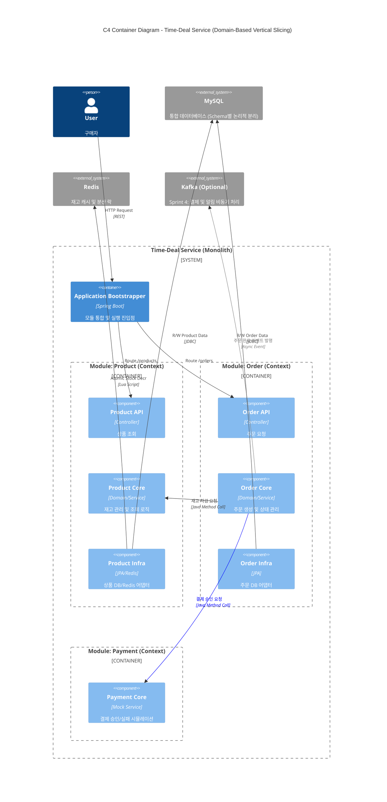

```mermaid
C4Context
    title C4 Container Diagram - Time-Deal Service (Domain-Based Vertical Slicing)

    Person(user, "User", "구매자")
    
    System_Boundary(time_deal_system, "Time-Deal Service (Monolith)") {
        
        Container(app, "Application Bootstrapper", "Spring Boot", "모듈 통합 및 실행 진입점")
        
        %% 1. Product Module
        Container_Boundary(product_boundary, "Module: Product (Context)") {
            Component(product_api, "Product API", "Controller", "상품 조회")
            Component(product_core, "Product Core", "Domain/Service", "재고 관리 및 조회 로직")
            Component(product_infra, "Product Infra", "JPA/Redis", "상품 DB/Redis 어댑터")
        }

        %% 2. Order Module
        Container_Boundary(order_boundary, "Module: Order (Context)") {
            Component(order_api, "Order API", "Controller", "주문 요청")
            Component(order_core, "Order Core", "Domain/Service", "주문 생성 및 상태 관리")
            Component(order_infra, "Order Infra", "JPA", "주문 DB 어댑터")
        }
        
        %% 3. Payment Module (Mock)
        Container_Boundary(payment_boundary, "Module: Payment (Context)") {
            Component(payment_core, "Payment Core", "Mock Service", "결제 승인/실패 시뮬레이션")
        }
    }

    %% External Systems
    System_Ext(mysql, "MySQL", "통합 데이터베이스 (Schema별 논리적 분리)")
    System_Ext(redis, "Redis", "재고 캐시 및 분산 락")
    System_Ext(kafka, "Kafka (Optional)", "Sprint 4: 결제 및 알림 비동기 처리")

    %% Relationships
    Rel(user, app, "HTTP Request", "REST")
    
    %% Routing
    Rel(app, product_api, "Route /products")
    Rel(app, order_api, "Route /orders")

    %% Internal Domain Flow (Order -> Product/Payment)
    Rel(order_core, product_core, "재고 차감 요청", "Java Method Call")
    Rel(order_core, payment_core, "결제 승인 요청", "Java Method Call")
    
    %% Async Flow (Future)
    Rel(order_core, kafka, "주문 완료 이벤트 발행", "Async Event")

    %% Infra Access
    Rel(product_infra, mysql, "R/W Product Data", "JDBC")
    Rel(product_infra, redis, "Atomic Stock Decr", "Lua Script")
    Rel(order_infra, mysql, "R/W Order Data", "JDBC")
    
    UpdateRelStyle(order_core, kafka, $textColor="gray", $lineColor="gray", $offsetX="5")
    UpdateRelStyle(order_core, payment_core, $textColor="blue", $lineColor="blue")
```
