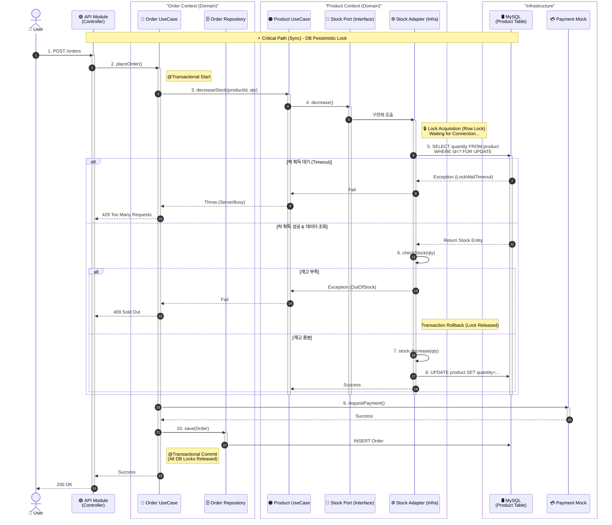

# **📊 Core Sequence Diagram: 선착순 주문 프로세스 (Sync Flow)**

이 다이어그램은 **주문 요청이 들어왔을 때, 시스템 내부에서 어떤 모듈을 거쳐 락(Lock)을 걸고 데이터를 처리하는지**를 적나라하게 보여줍니다.

---

### **🔍 다이어그램의 기술적 포인트 (Technical Highlights)**

이 다이어그램이 시니어 포트폴리오로서 갖는 의미는 다음과 같습니다.

1. **명확한 경계 (Bounded Contexts):**
    - `Order Context`와 `Product Context`가 박스로 명확히 나뉘어 있습니다.
    - 주문 로직은 상품의 DB 스키마나 락 구현 방식을 전혀 모릅니다. 오직 `decreaseStock()` 메서드만 호출합니다.
2. **락의 생명주기 시각화 (Lock Lifecycle):**
    - `Try Lock` → `Get Stock` → `Decr Stock` → `Release Lock`의 과정이 적나라하게 드러나 있습니다.
    - 이 부분이 바로 **Sprint 3에서 우리가 가장 깊게 파고들 지점**입니다. (Redis Lock이냐 DB Lock이냐에 따라 6~11번 과정이 바뀝니다.)
3. **헥사고날 아키텍처 반영:**
    - `ProductService`는 `StockPort`(인터페이스)를 호출하고, 실제 락 로직은 `StockAdapter`(인프라)에 숨어 있습니다.
    - 이것은 "비즈니스 로직을 기술(Redis)로부터 보호한다"는 우리의 철학을 보여줍니다.
4. **하이브리드 아키텍처의 암시:**
    - 12번 과정(`requestPayment`)에 **"추후 비동기 전환 대상"**이라는 노트를 달아두어, 우리가 **Phase 2(EDA)**를 염두에 두고 있음을 보여줍니다.

